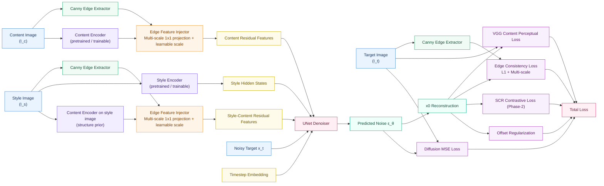

# Edge-Conditioned FontDiffuser Framework

```mermaid
flowchart LR
    %% Inputs
    A1["Content Image<br/>(I_c)"]:::input --> B1["Canny Edge Extractor"]:::edge
    A2["Style Image<br/>(I_s)"]:::input --> B2["Canny Edge Extractor"]:::edge
    A3["Target Image<br/>(I_t)"]:::input --> B3["Canny Edge Extractor"]:::edge

    A1 --> C1["Content Encoder<br/>(pretrained / trainable)"]:::encoder
    A2 --> C2["Style Encoder<br/>(pretrained / trainable)"]:::encoder
    A2 --> C3["Content Encoder on style image<br/>(structure prior)"]:::encoder

    B1 --> D1["Edge Feature Injector<br/>Multi-scale 1x1 projection + learnable scale"]:::injector
    B2 --> D2["Edge Feature Injector<br/>Multi-scale 1x1 projection + learnable scale"]:::injector

    C1 --> D1
    C3 --> D2

    C2 --> E1["Style Hidden States"]:::state
    D1 --> E2["Content Residual Features"]:::state
    D2 --> E3["Style-Content Residual Features"]:::state

    E1 --> F["UNet Denoiser"]:::unet
    E2 --> F
    E3 --> F

    G["Noisy Target x_t"]:::input --> F
    H["Timestep Embedding"]:::state --> F
    F --> I["Predicted Noise ε_θ"]:::output
    I --> J["x0 Reconstruction"]:::output

    J --> K1["VGG Content Perceptual Loss"]:::loss
    J --> K2["Edge Consistency Loss<br/>L1 + Multi-scale"]:::loss
    J --> K3["SCR Contrastive Loss (Phase-2)"]:::loss
    J --> K4["Offset Regularization"]:::loss
    I --> K5["Diffusion MSE Loss"]:::loss
    B3 --> K2
    A3 --> K1
    A3 --> K5
    K1 --> L["Total Loss"]:::total
    K2 --> L
    K3 --> L
    K4 --> L
    K5 --> L

    classDef input fill:#EAF4FF,stroke:#4A90E2,color:#1A355E,stroke-width:1.2px;
    classDef edge fill:#F0FBF6,stroke:#2BB673,color:#0F5132,stroke-width:1.2px;
    classDef encoder fill:#F3EEFF,stroke:#7B61FF,color:#35226B,stroke-width:1.2px;
    classDef injector fill:#FFF4E8,stroke:#FF9F43,color:#7A3E00,stroke-width:1.2px;
    classDef state fill:#FFFBEA,stroke:#D4B106,color:#6A5500,stroke-width:1.2px;
    classDef unet fill:#FFEFF4,stroke:#E64980,color:#6B1232,stroke-width:1.3px;
    classDef output fill:#EFFFFA,stroke:#12B886,color:#0B4F3B,stroke-width:1.2px;
    classDef loss fill:#F8F0FC,stroke:#AE3EC9,color:#5A1A69,stroke-width:1.2px;
    classDef total fill:#FFF0F6,stroke:#F06595,color:#7A1E43,stroke-width:1.6px;
```

> 训练时，边缘条件贯穿 phase-1 与 phase-2；推理时从 content/style 图像动态提取边缘并注入同一通路。
